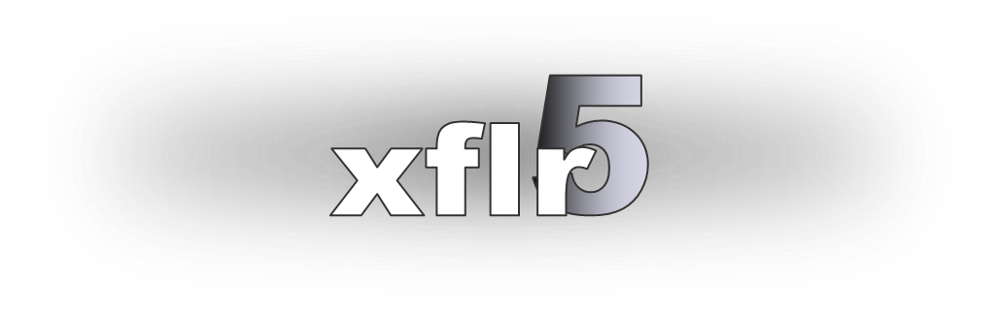
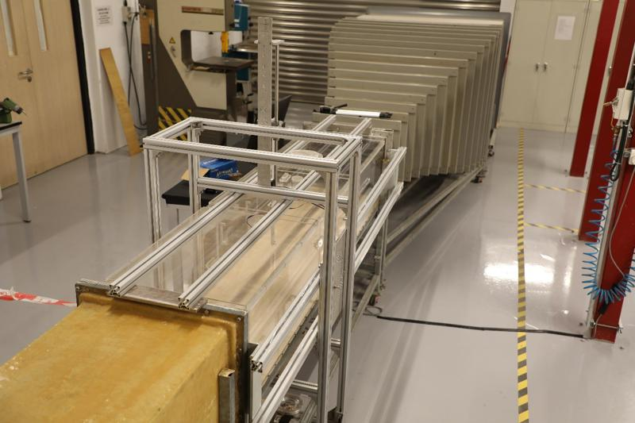

# Aerodynamics of a Fixed Weather Drone ✈️

### Context
This project was undertaken as part of the **MECH-3640: HKUST Aerodynamics** course.

## Tools Used 🛠️
- **Data Postprocessing**: Matlab, Excel
- **Report Documentation**: LaTeX
- **Numerical Simulation**: XFLR5

## The 3 Key Takeaways 📊
- Different methods can describe the same phenomenon but yield significantly varied results.
- Numerical and experimental work requires thorough verification and validation.
- Assumptions and simplifications must always be carefully considered when applying models.

## Project Overview 

This project analyzed the behavior of various NACA airfoils using three scientific approaches: Theoretical, Numerical, and Experimental.

- The **Theoretical framework** was developed throughout the MECH-3640 coursework during the semester.
- The **Numerical experiments** were conducted using the XFLR5 interface, a basic yet efficient 2D airfoil flow simulator. While its underlying algorithm is not highly accurate, it provides quick and contextually sufficient results for this analysis.

  

- The **Experimental data** was gathered using the state-of-the-art wind tunnel at HKUST's Aerodynamics and Acoustics Facility (AAF).  
  [Visit AAF Website](https://aaf.ust.hk/)

  

Finally, all results were compiled into a project report: **Project Report.pdf**

### Author 👨‍🔬
- **Selim SHERIF**
