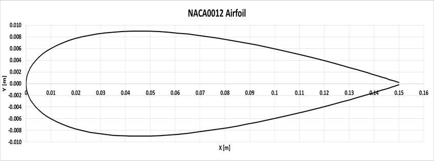

# Introduction to Aerospace CFD Labs 

### Context
This project is a set of two labs undertaken as part of the **HKUST MECH-4830: Introduction to Aerospace CFD** course.

## Tools Used 🛠️
- **Data Postprocessing**: Matlab, Paraview, Linux command line
- **Report Documentation**: LaTeX
- **Numerical Simulation**: OpenFOAM

## The 3 Key Takeaways 📊
- CFD is a complex field with numerous variables and assumptions to consider.
- A CFD simulation is assumed incorrect until proven otherwise.
- Proper data recording and saving practices are crucial for successful projects.

## Project Overview 🌐
The goal of these labs was to develop a practical understanding of the OpenFOAM software. The labs focused on analyzing fluid flow in steady and unsteady conditions.

---

### LAB 1: Steady Airflow Around a 2D Airfoil

This lab introduced OpenFOAM and focused on steady-state airflow around a 2D NACA-0012 airfoil. The objective was to understand the step-by-step process of setting up and running a CFD simulation.

**Key Areas of Study:**
- **Case Setup and Parameter Definition:**  
  The lab began by defining simulation parameters, including fluid properties, initial conditions, and boundary conditions. Governing equations and assumptions, such as the incompressibility of airflow, were outlined.

  

- **Computational Domain and Mesh Generation:**  
  The impact of computational domain size on results was analyzed. Mesh independence tests were performed to ensure accuracy without incurring unnecessary computational costs.

- **Numerical Schemes and Solver Settings:**  
  Various numerical schemes were evaluated to determine their effect on simulation results. Solver settings, such as relaxation factors, were fine-tuned for improved convergence and stability.

- **Aerodynamic Performance Analysis:**  
  Lift and drag coefficients were calculated for different angles of attack. The results were validated against theoretical and experimental data to assess the simulation's accuracy.

  

**Figure: Velocity field around the airfoil**

--- 

### LAB 2: Unsteady Airflow Around a 2D Cylinder

Building on the first lab, this lab focused on transient simulations of unsteady airflow around a 2D cylinder. The scenario modeled conditions similar to airflow around a moving truck's exhaust pipe.

**Key Areas of Study:**
- **Case Setup and Parameters:**  
  Detailed setup included defining transient conditions and selecting appropriate solvers. Governing equations for unsteady flow and assumptions about turbulence modeling were incorporated.

- **Effect of CFL Number and Time Step:**  
  The influence of CFL number and time step on stability and accuracy was studied, alongside computational time considerations.

- **Turbulence Modeling and Wall Treatments:**  
  Different turbulence models, such as the Spalart-Allmaras and k-ω SST models, were compared. Wall-modeled and wall-resolved approaches were tested to analyze their effects on cylinder surface properties.

- **Wake and Flow Analysis:**  
  The cylinder's wake behavior was examined, including lift and drag fluctuations. The Strouhal number was calculated to characterize vortex shedding and its dependency on Reynolds number and cylinder dimensions.

---

Both labs were compiled into comprehensive reports shared in this repository. While the original simulation files are unavailable, the results are reproducible using the provided documentation.

### Author 👨‍🔬
- **Selim SHERIF**
