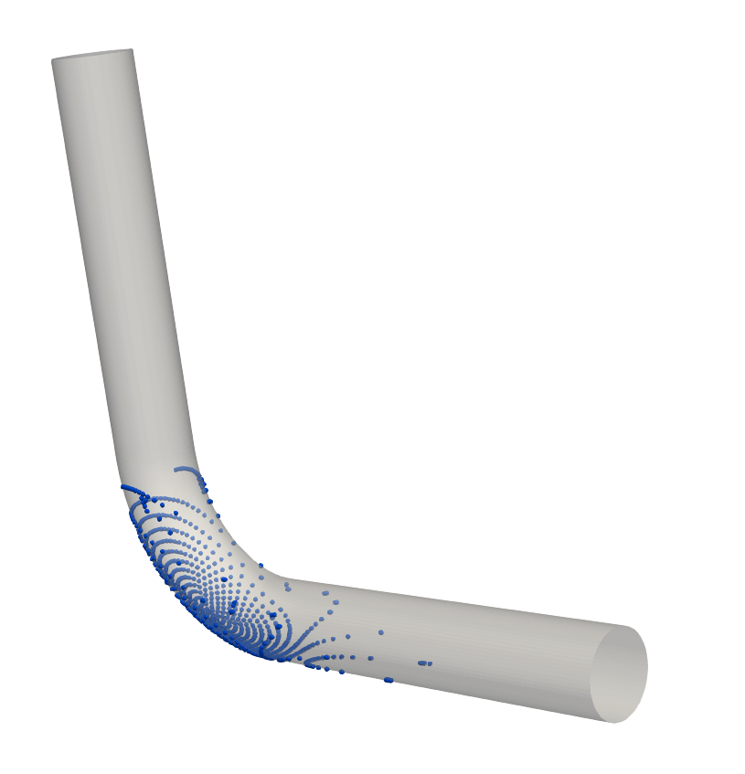
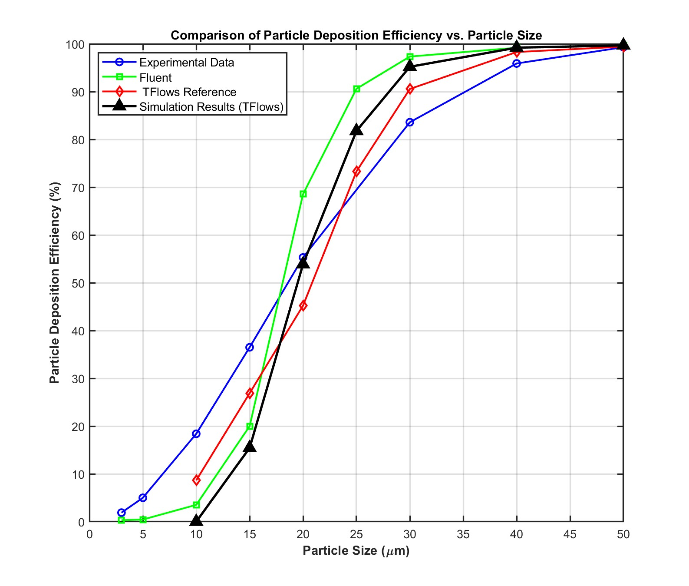

# Particle Deposition Prediction Around a 90-Degree Bend  🌊

### Context:
This project was completed as part of the **[**CFD Dose**](https://www.cfddose.com/) Comprehensive Mentorship** program led by [**Mohamed Aly Sayed**](https://www.linkedin.com/in/mohamedsayedh/?originalSubdomain=ch).

---

## 3 Key Takeaways 📊
1. **Turbulence Modeling Matters**: The choice of turbulence models (e.g., k-ε, RANS/LES) significantly impacts deposition accuracy.  
2. **Particle Deposition Behavior**: Deposition efficiency follows an **S-shaped (logistic-like) curve** with particle size.  
3. **Open-Source Trade-off**: Open-source CFD tools offer **greater customizability** but are **more complex to set up and run**.  

---

## Tools Used 🛠️
- **Numerical Simulation**: [T-Flows](https://github.com/DelNov/T-Flows) *(See [More About T-Flows](#more-about-t-flows) below if unfamiliar)*
- **Data Postprocessing**: MATLAB, ParaView, Shell Scripts
- **Report Documentation**: LaTeX


## Table of Contents
1. [Overview](#overview)
2. [Repository Structure](#repository-structure)
3. [Simulation Results](#simulation-results)
4. [References](#references)

---

## Overview
This project simulates **particle-laden flow** through a **90° pipe bend** using **T-Flows CFD**. It aims to:
- Predict particle deposition patterns.
- Investigate how particle sizes affect deposition.
- Validate results against existing benchmarks.

Insights from this study aim to optimize industrial systems featuring curved geometries (e.g., ducts, exhaust lines), where secondary flows and swirling significantly influence particle trajectories.



---

## Repository Structure
```
Particle_Deposition_Prediction_in_a_90-Degree_Bend/ 
├── README.md # Project overview 
├── Control_files/ # Input and control files for T-Flows 
├── Mesh/ # Mesh data and conversion scripts 
├── Results/ # Numerical results and reference data 
├── Particle_Deposition_Prediction_in_a_90_Degree_Bend.pdf # Comprehensive PDF report
└── README.md # Project overview 

```
- **Control_files/**: Contains all the input files and control files required for running T-Flows simulations.
- **Mesh/**: Includes mesh data and scripts for mesh generation and conversion.
- **Results/**: Stores numerical results, including particle efficiencies and reference data for comparison.
- **Report.pdf**: The detailed PDF report of the project.


---

## Simulation Results
- **Efficiency Curve**: Generated a standard S-shaped particle efficiency curve, illustrating distinct behaviors across various particle sizes.
- **Data Comparison**: Simulation results were compared with reference data to identify and understand discrepancies.



---

## References
1. Sayed, M. A. H. M. (2022). *On the Capability of Wall-Modeled Large Eddy Simulations to Predict Particle Dispersion in Complex Turbulent Flows*. EPFL Thesis No. 10054. [Link](https://infoscience.epfl.ch/entities/publication/3dd44c56-3d5a-4536-a7d4-268ee04703b0).

---

### Author 👨‍🔬
- **Selim Sherif**
---

## More About T-Flows

**T-Flows** 🌊 is an **open-source CFD solver** optimized for **incompressible turbulent flows** with advanced **RANS, LES, and hybrid turbulence models**. It is designed for academic research and supports **Lagrangian particle tracking, heat transfer, and multiphase flows**.

### Why Use T-Flows?
- **Optimized for High-Re Turbulent Flows**: Handles complex secondary flow structures.
- **Lagrangian Particle Tracking**: Essential for studying deposition in curved geometries.
- **Highly Customizable**: Open-source with flexibility for solver modifications.
- **Parallel Computing Ready**: Scales efficiently for large simulations.

In this project, **T-Flows** was used to predict **particle deposition patterns** in a **90-degree pipe bend**, leveraging its turbulence modeling and particle transport capabilities.
