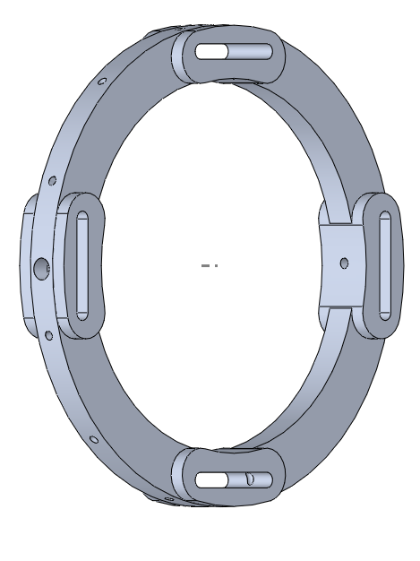
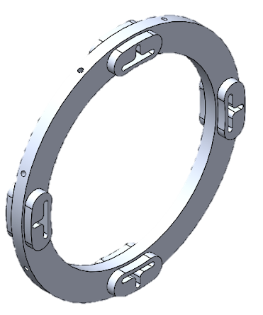
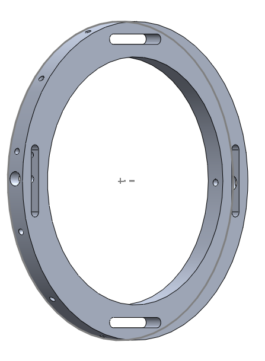
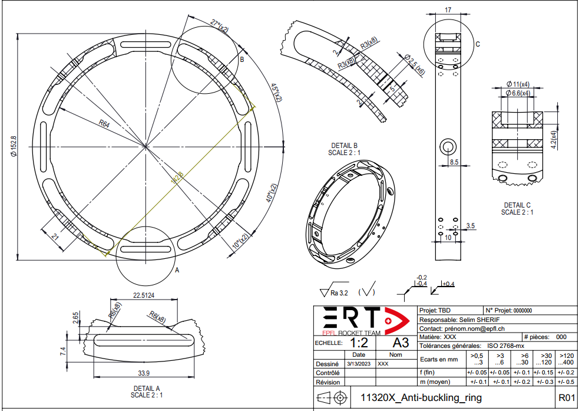
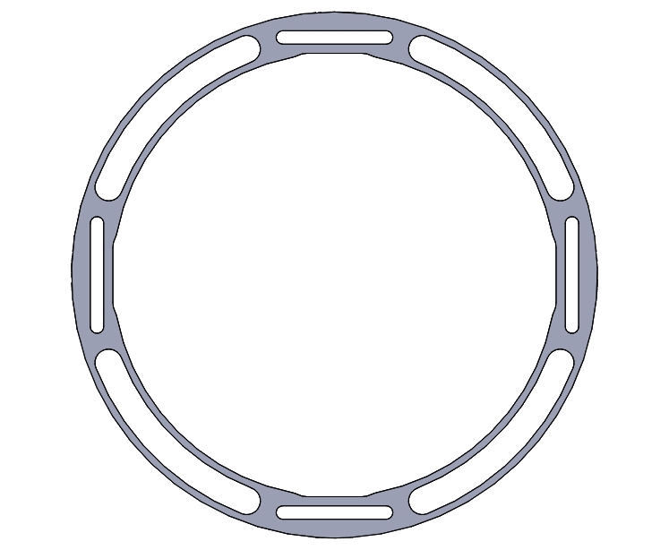
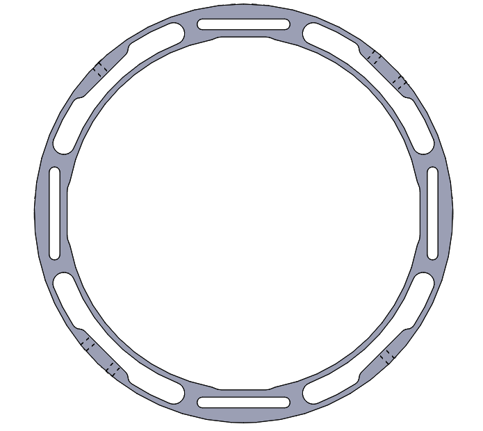
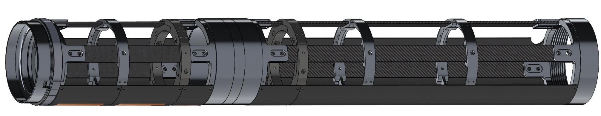
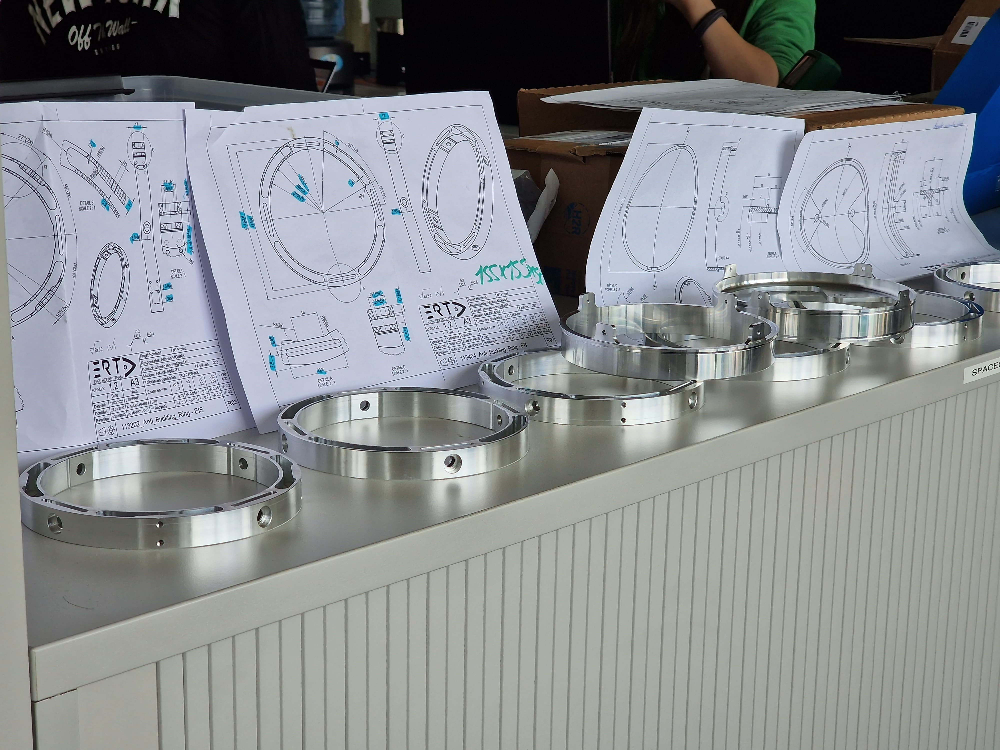

# CAD Conception: Anti-Buckling Ring

---

## 🚀 Context

This project was developed as part of the **EPFL Rocket Team**, where I contributed as a member of the **Structural Engineering division**. My primary responsibility was the conception, development, and refinement of several CAD models and components. One of the most significant contributions I made was the **Anti-Buckling Ring**, a crucial element in ensuring the structural integrity of the rocket.

---
## 📊 The 3 Key Takeaways

1. **Solve Real Problems:**  
   As Elon Musk said, "An engineer's biggest mistake is optimizing for a problem that doesn’t exist." I focused on addressing actual structural challenges rather than unnecessary optimizations.

2. **Clear Naming Improves Collaboration:**  
   Consistent nomenclature in shared software like **3DEXPERIENCE** reduces confusion and improves workflow efficiency.

3. **Curiosity & Hard Work Matter:**  
   You don’t need to be an expert to contribute meaningfully—curiosity and persistence can drive progress.

## 🛠️ Tools & Technologies

- **CAD Software:** SolidWorks, 3DEXPERIENCE

---

## 🎯 Motivation

This project was an opportunity to apply the technical knowledge I gained in my early university years to a real-world engineering challenge. It allowed me to:
- Design structural components for aerospace applications.
- Work within a structured engineering workflow and collaborate with a team.

## 📖 Table of Contents

1. [Overview of the Project](#overview-of-the-project)
2. [Goal of the Component](#goal-of-the-component)
3. [Repository Contents](#repository-contents)
4. [Project Workflow](#project-workflow)
5. [Design and Conception](#design-and-conception)
6. [Optimization Stage](#optimization-stage)
7. [Manufacturing](#manufacturing)

---

## Overview of the Project

The **Anti-Buckling Ring** was developed for the **2023 EPFL Rocket Team Competition: Rocket Nordend**, the team's first rocket utilizing a **bi-liquid propulsion system**. Transitioning from a traditional solid-fuel approach introduced new structural challenges, requiring a robust yet lightweight support system.

The Anti-Buckling Ring was designed to prevent structural failure by reinforcing the carbon fiber rods responsible for transferring loads throughout the rocket body.

---

## Goal of the Component

The **Anti-Buckling Ring** serves several key functions:
- **Prevent Buckling:** Reinforce four carbon fiber rods that transfer vertical loads, reducing the risk of structural failure.
- **Ensure Structural Integrity:** Provide a stable interface between multiple internal components, including panels, antennas, and the rocket’s outer shell.
- **Balance Weight and Strength:** Minimize material use while ensuring the ring remains strong enough to withstand launch and flight stresses.

---

## Repository Contents

- **`2D` Directory:** Contains 2D sketches and engineering drawings from the initial design phase.
- **`3D` Directory:** Includes detailed 3D CAD models created in SolidWorks and 3DEXPERIENCE.
- **`Topology Studies` Directory:** Contains simulation files and topology optimization results used to refine the final design.
- **README.md:** This document, summarizing the project and workflow.

---

## Project Workflow

The Anti-Buckling Ring development followed a structured workflow:

1. **Design and Conception:**
   - Identified functional requirements and constraints.
   - Evaluated manufacturability and material selection.
2. **CAD Modeling:**
   - Created initial models in SolidWorks and 3DEXPERIENCE.
   - Iteratively refined the design based on structural analysis.
3. **Simulation & Optimization Loop:**
   - Conducted topology tests to identify low-stress regions.
   - Reduced material use while maintaining structural performance.
4. **Manufacturing and Assembly:**
   - Outsourced production based on detailed 2D drawings.
   - Integrated the component with the carbon fiber rods during final assembly.

---

## Design and Conception

A structured design approach was followed to ensure optimal performance. Key questions considered during this phase included:
- **What are the specific structural requirements?**
- **How can the design be made as efficient as possible?**
- **Is the part manufacturable using CNC techniques?**

Multiple iterations were explored, refining the shape, weight distribution, and integration points.

### Design Concepts

  
  
  

---

## Optimization Stage

To achieve the best balance of weight and strength, the Anti-Buckling Ring underwent multiple optimization cycles. The process involved:
- **Topology Optimization:** Identifying low-stress areas for material reduction.
- **Load Analysis:** Ensuring the ring could withstand maximum expected forces.
- **Iterative Refinements:** Making adjustments to improve manufacturability.

### Topology Optimization

  

Additional details can be found in the `Topology Studies` directory.

### Final CAD Design
**2D Engineering Drawings:**

  

**3D CAD Models:**

  
  

**Final 3D Assembly:**

  

---

## Manufacturing

The manufacturing process followed these steps:
- **Production:** A third-party manufacturer produced the ring using CNC machining.
- **Quality Control:** Components were inspected for precision and adherence to design specifications.
- **Final Integration:** The ring was installed onto the rocket’s carbon fiber rods and secured for stability.

### Physical Result

  

---
This README provides an overview of the design, development, and implementation process for the **Anti-Buckling Ring**. 
 
For further details, please explore the repository's contents.

  

