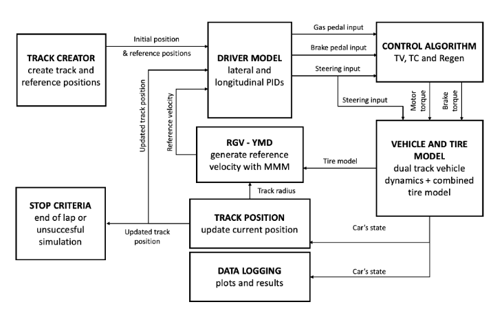

# Development of a Formula Student Lap Time Simulator 🏎️

---

## 🚀 Context
This project is being developed as part of the **EPFL Racing Team**. It builds on years of contributions from previous developers and aims to create a **Lap Time Simulator (LTS)** that evaluates and optimizes car performance. The LTS is a critical tool for enabling data-driven engineering decisions in the highly competitive Formula Student racing environment.

---

## ⚠️ Disclaimer
This project is **closed-source**, and implementation details cannot be shared publicly. This README provides an overview of the project's purpose, tools, challenges, and significance. For more specific details feel free to reach out!

---

## 🛠️ Tools & Technologies
- **Software**: Matlab’s Simulink, Matlab, Simscap
- **Coding Paradigm**: Connective-based, modular system modeling

---

## 🎯 Motivation
This project offers a chance to work on **numerical modeling**, **simulation**, and **motorsports engineering**, areas of strong interest and relevance to me. Developing the Lap Time Simulator combines technical challenges with practical applications, providing insights into race car performance optimization.

It is an opportunity to refine technical skills, apply advanced simulation techniques, and tackle real-world engineering problems while contributing to a team.

---

## 📖 Table of Contents
1. [Overview of the Simulator](#overview-of-the-simulator)
2. [Challenges and Insights](#challenges-and-insights)
3. [Key Applications](#key-applications)
4. [Future Work](#future-work)

---

## Overview of the Simulator

The **Lap Time Simulator (LTS)** is designed using **Matlab’s Simulink** and a **connective-based, modular system modeling approach**. This modular structure divides the car into individual components for targeted analysis and seamless improvements:
- **Suspension Block**: Simulates the car's dynamic response under varying conditions.
- **Tire Block**: Captures the critical interaction between the tire and road surface, essential for performance optimization.
- **Driver Model**: Mimics driver behavior and decision-making on the track.
- **Vehicle/Velocity-yaw Block**: Represents the car dynamics and kinematics by applying conservation laws to the whole car.

The goal is to ensure components integrate seamlessly with others, enabling a detailed and comprehensive simulation of the car’s behavior over a lap.

---

## Challenges and Insights

Developing a sophisticated simulator like the LTS involves overcoming several technical challenges:

1. **Numerical Stability**: Maintaining system stability during complex calculations, especially under extreme performance conditions.
2. **Modeling Accuracy**: Striking the right balance between precision and computational efficiency without oversimplifying critical components.
3. **Tire Model Complexity**: The tire model is the most intricate aspect, focusing on **tire-road patch interaction**, the core area where performance forces are generated.

Collaborating with teammates to solve these challenges is an engaging process, creating a never-ending feedback loop of constant improvement.

---

##  Key Applications

The **Lap Time Simulator** serves as a strategic asset for the team, enabling:

1. **Design Validation**: Evaluating whether proposed modifications are impactful enough to justify implementation.
2. **Rapid Iteration**: Facilitating quick assessments of last-minute design changes to ensure optimal performance.
3. **Digital Twin Development**: Creating a virtual replica of the car, with potential for future enhancements, such as integrating a **driver-in-the-loop** simulation.

These applications demonstrate the simulator's role in driving innovation and maintaining competitive performance levels within the EPFL Racing Team.

---

## Future Work

To further enhance the Lap Time Simulator, the following improvements are planned:

- **Enhanced Driver Model**: Incorporating more nuanced driver behaviors and decision-making processes.
- **User Interface Improvements**: Developing a more intuitive interface for easier interaction and analysis.
- **Driver-in-the-loop Integration**: Implementing a system to simulate real-time driver inputs within the simulator.
- **Accuracy Refinements**: Further refining the simulation accuracy for more precise performance predictions.

These future developments aim to increase the simulator's accuracy, usability, and overall impact on the team's engineering decisions.

---

## Thank You! 🙏
Thank you for reading! If you would like to discuss this project further or have any questions, feel free to [contact me](../../README.md#contact)

---
